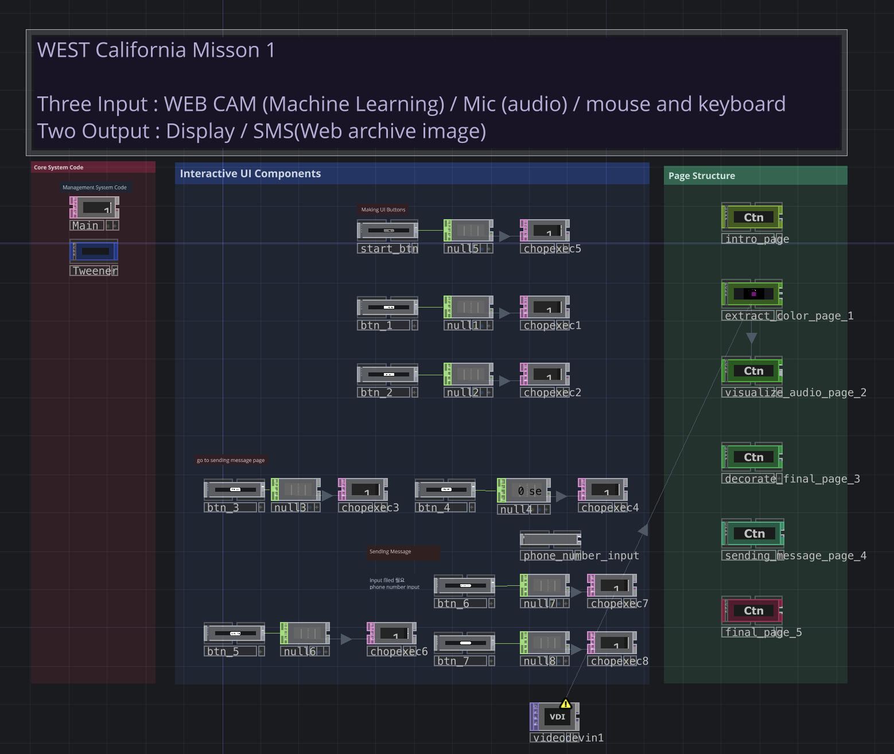
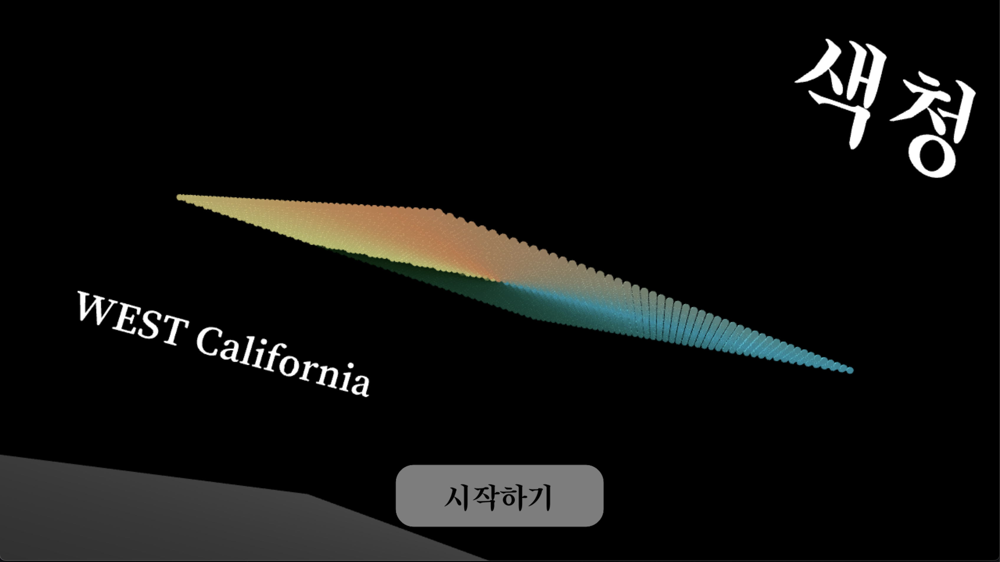
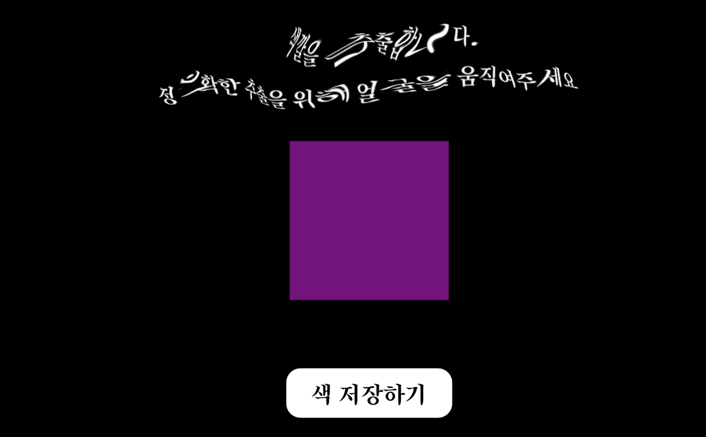
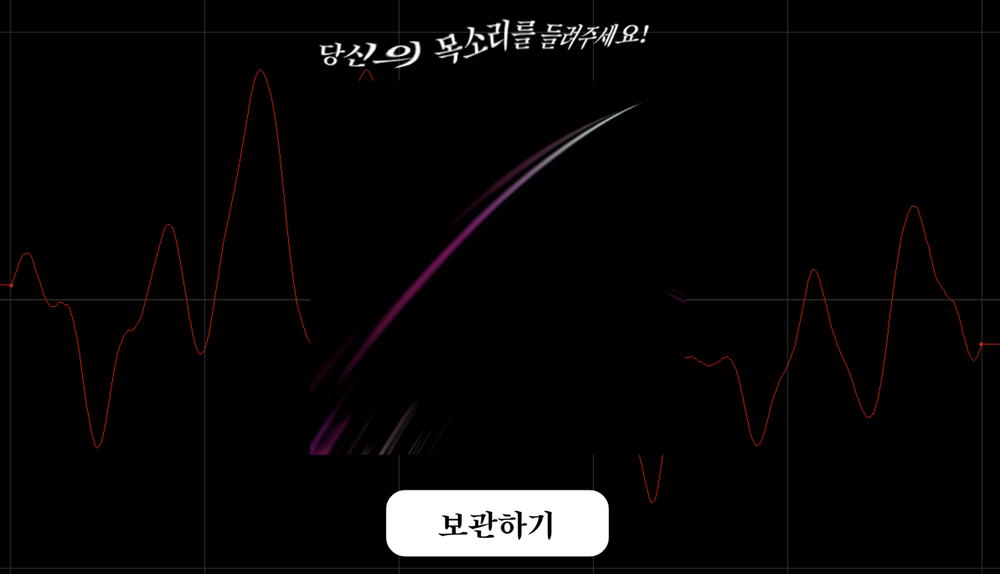
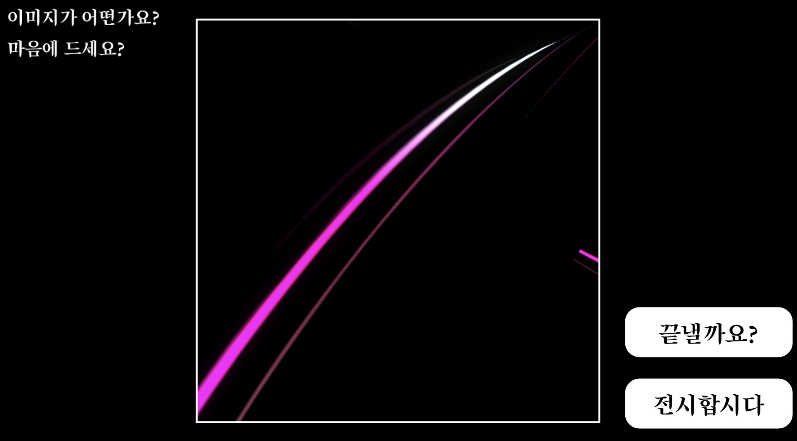
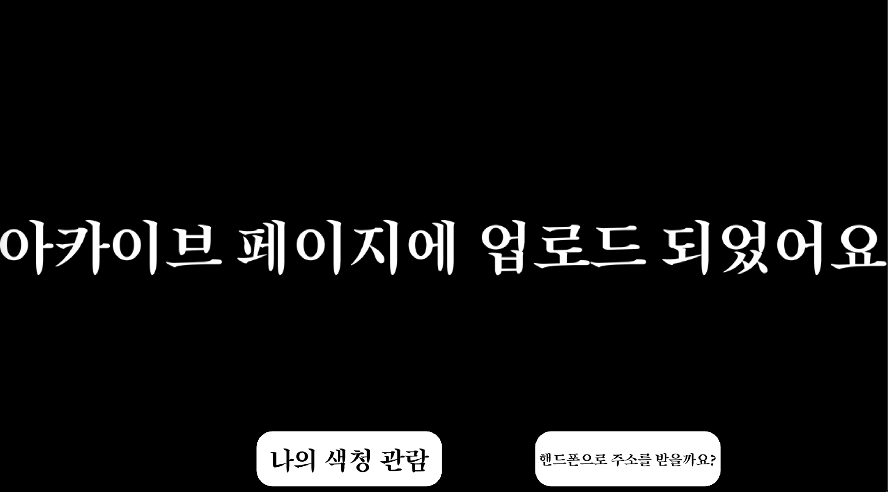
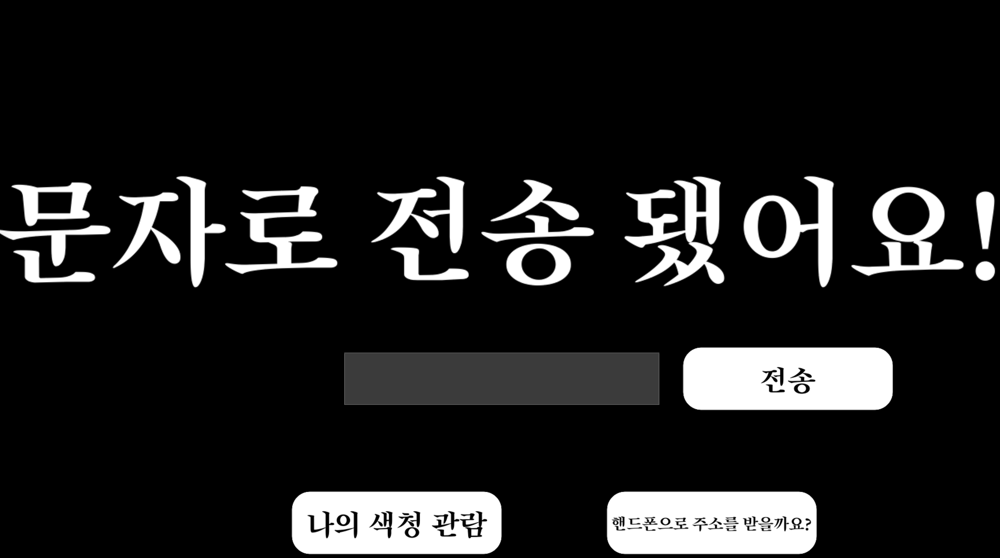
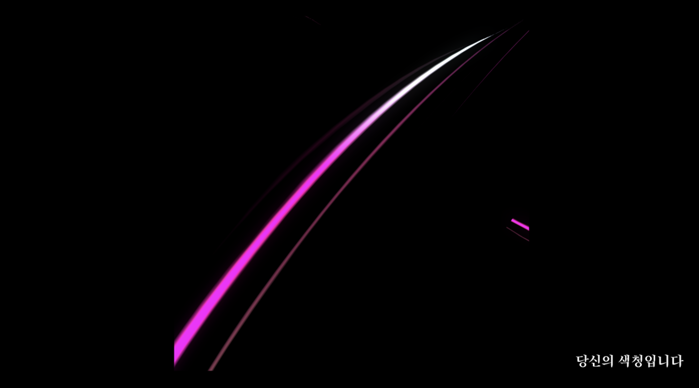

# K'arts 융합예술센터 Art-collider 예술,경계,충돌 심화과정 작업 모음

## <mark>Team WEST California</mark>

## Module 1

| 주제              | 3 Inputs 2 Outputs                               |
| ----------------- | ------------------------------------------------ |
| 작품명            | 색청 色聽                                        |
| 맡은 역할         | interactive development                          |
| 사용한 툴         | Touchdesigner                                    |
| 사용한 라이브러리 | Tweener, TwillioSMSSender, imgbbUploader, openCV |

### 결과 이미지

### 회고

- 작업의 흐름이 선형적이라 불규칙성 혹은 다른 것을 상상해보기 어려운 것 같다.
- 기술적 구현은 적절히 해냈지만 미학적인 고민이 덜했던 것 같다.
  - 보여주는 방식을 왜 꼭 모니터를 세 개나 쓰려고 했으며... 보여주는 방식 자체를 조금 더 비틀어볼 수 있었던 것 같은데, 시도가 예측이 가는 것들이 대부분이었던 것 같다.
  - **따라서 작업을 보고 '질문'을 할 수 있는 기회를 자연스럽게 박탈하게 된 것 같다. 참여자의 우연성 혹은 다른 움직임을 만들어낼 수 있는 가능성이 충분했음에도 참여의 방식과 흐름이 선형적으로 고정되어 생각의 활로를 막아버리는 결과를 만들어냈던 것 같다.**
- 질문을 만들어내는 작업을 하기 위해서는 질문을 할 수 있는 나름의 장치와 창구들을 적절히 만들고 섞는 것이 중요할 것 같다. 기술적 구현에 대해서는, 꼭 해당 기술의 구현이 필수적이지 않는데 해야하는 당위성을 고려하지 않고 테크닉적인 쾌감만을 느끼게 하는 것은 더 잘하는 사람들이 많은 것 같다.
- SMS로 결과물을 받아보게 하는 것에 대해서는, 깔끔하게 잘 떨어지는 터치디자이너의 비주얼을 이전의 낭만을 담고 있는 아날로그적인 방식으로 치환한 것 같다는 의견을 받을 수 있었다.
