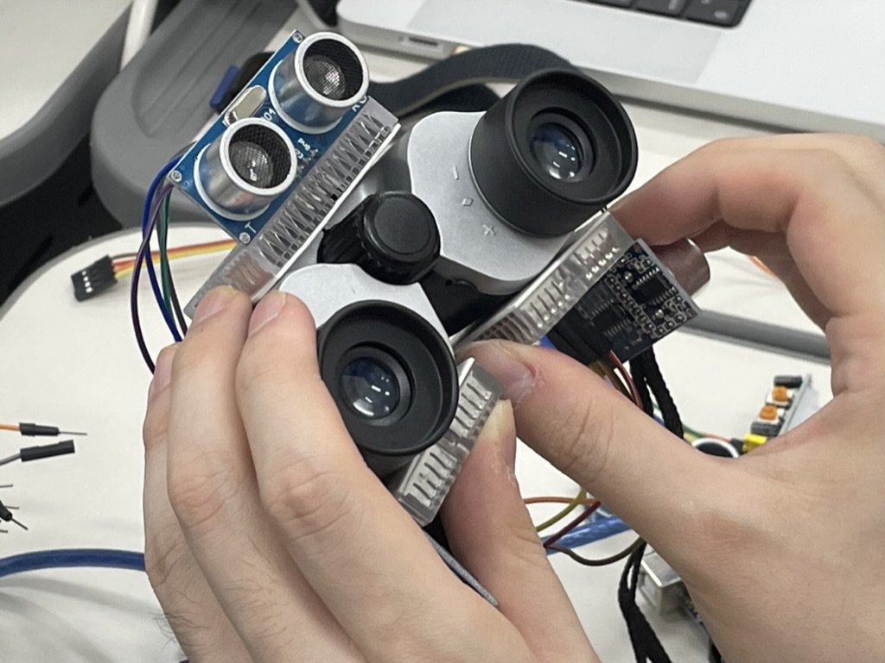
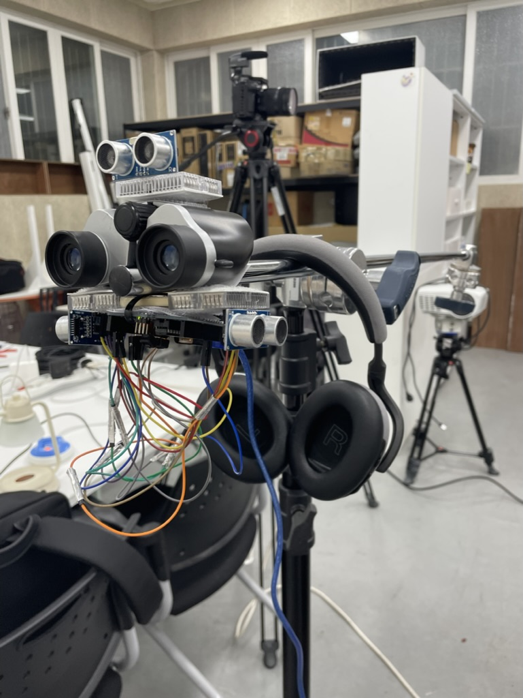
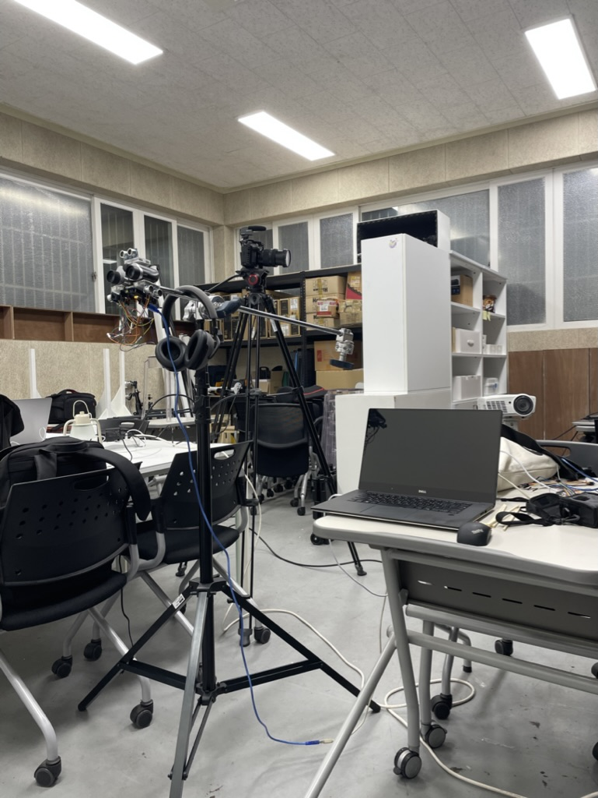
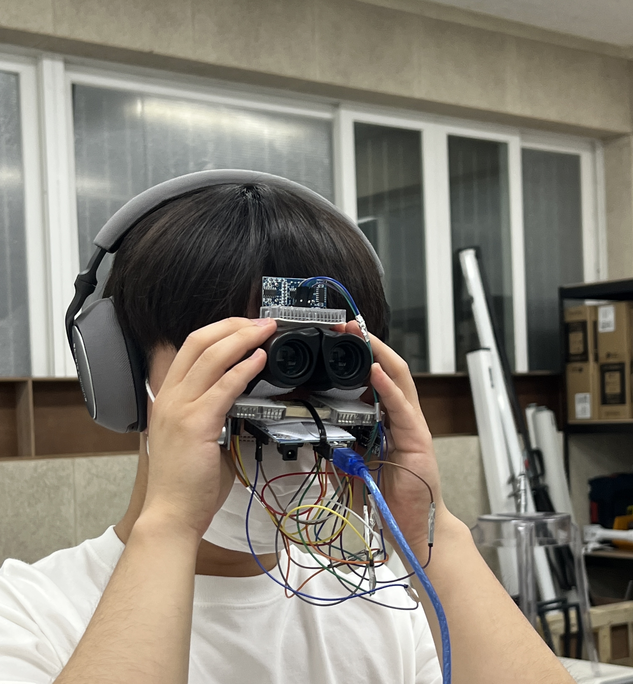
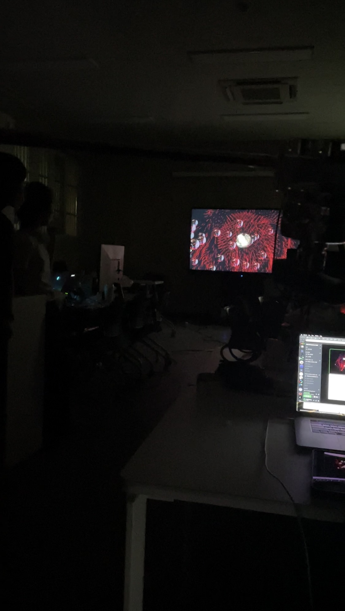
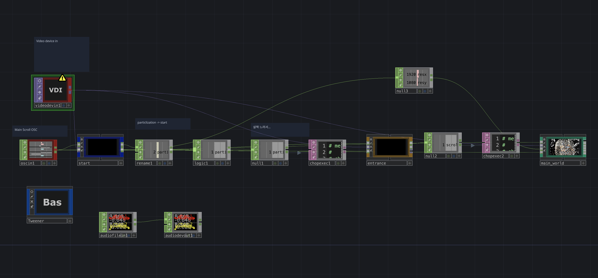
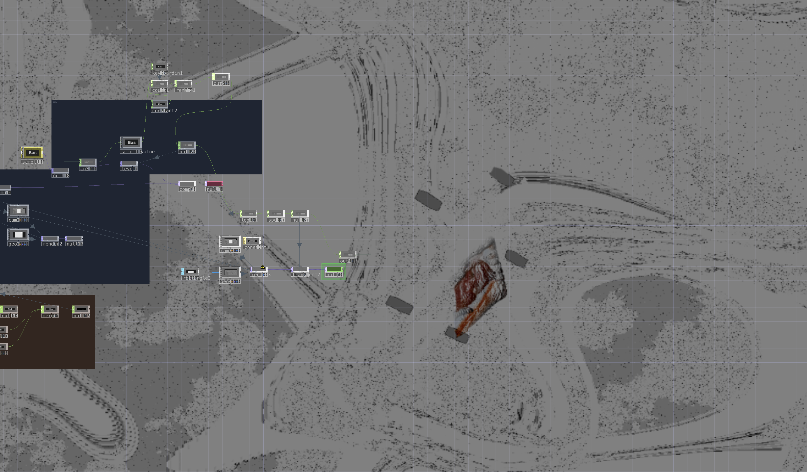
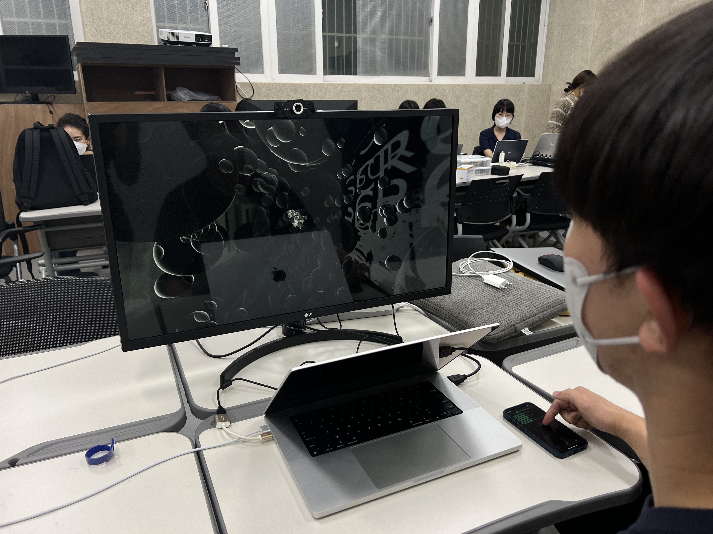

# K'arts 융합예술센터 Art-collider 예술,경계,충돌 심화과정 작업 모음

## <mark>Team WEST California</mark>

## Module 1

| 주제              | 3 Inputs 2 Outputs                               |
| ----------------- | ------------------------------------------------ |
| 작품명            | 색청 色聽                                        |
| 맡은 역할         | interactive development                          |
| 사용한 툴         | Touchdesigner                                    |
| 사용한 라이브러리 | Tweener, TwillioSMSSender, imgbbUploader, openCV |

### 결과 이미지

### 회고

- 작업의 흐름이 선형적이라 불규칙성 혹은 다른 것을 상상해보기 어려운 것 같다.
- 기술적 구현은 적절히 해냈지만 미학적인 고민이 덜했던 것 같다.
  - 보여주는 방식을 왜 꼭 모니터를 세 개나 쓰려고 했으며... 보여주는 방식 자체를 조금 더 비틀어볼 수 있었던 것 같은데, 시도가 예측이 가는 것들이 대부분이었던 것 같다.
  - **따라서 작업을 보고 '질문'을 할 수 있는 기회를 자연스럽게 박탈하게 된 것 같다. 참여자의 우연성 혹은 다른 움직임을 만들어낼 수 있는 가능성이 충분했음에도 참여의 방식과 흐름이 선형적으로 고정되어 생각의 활로를 막아버리는 결과를 만들어냈던 것 같다.**
- 질문을 만들어내는 작업을 하기 위해서는 질문을 할 수 있는 나름의 장치와 창구들을 적절히 만들고 섞는 것이 중요할 것 같다. 기술적 구현에 대해서는, 꼭 해당 기술의 구현이 필수적이지 않는데 해야하는 당위성을 고려하지 않고 테크닉적인 쾌감만을 느끼게 하는 것은 더 잘하는 사람들이 많은 것 같다.
- SMS로 결과물을 받아보게 하는 것에 대해서는, 깔끔하게 잘 떨어지는 터치디자이너의 비주얼을 이전의 낭만을 담고 있는 아날로그적인 방식으로 치환한 것 같다는 의견을 받을 수 있었다.

## Module 2

| 주제      | USING SOUND!                           |
| --------- | -------------------------------------- |
| 작품명    | 소크라테스의 눈 Site of Socrates       |
| 맡은 역할 | interactive development / Sound Design |
| 사용한 툴 | Touchdesigner / Ableton                |

### 결과 이미지

### 회고

- <애드 호키즘> 이라는 책을 읽고 싶어졌다. 작업에서의 임시변통, 무작위적인 만듦새, 빠른 제작이 얼마나 중요한지 다시금 깨닫게 됐다.
- 복잡한 무언가가 아니더라도, 기존의 기성품을 활용하는 방식의 접근도 재밌을 수 있다는 것을 알게 됐다.
- 피드백
  - 망원경을 처음 들여다봤을 때 사이렌 사운드가 조금 길게 나와서, 관람객의 입장에서 길게 쳐다보지 않는 이상 오랫동안 작업물에 위치하기 어려울 것 같다. _동의하는 의견이었다. 사람들을 어떻게 작업에 끝까지 빠져들게 할지... 자연스럽게 스며들어서 작업을 천천히 끝까지 관람하게 하는 방법에 대한 생각이 필요하다. -> 이런것도 경험 디자인의 한 측면이 아닐런지_
  - 망원경을 썼을 때 나타나는 구체의 이미지들은 일부러 '구'의 형태로 만든 것인가? _미적인 측면도 분명 있었던 것 같다. 하지만 망원경이나, 렌즈를 통해 바라보는 시선을 최대한 구현해보고 싶었던 것 같다. 빠르게 구현하느라 엄청나게 의미적으로 접근하진 않았지만, 생각보다 사람들은 불규칙하고 묘한 이미지에 더욱 더 매료를 느낀다는 것을 알게 됐다._
  - 전시가 될 때, 망원경을 쓰지 않은 사람도 전체적인 화면을 봐야할 필요가 있을까? 개인적인 경험을 위한 망원경이 아닐지? _개인적인 경험이라고 느낄 수 있지만, 작업에서 보여주고자 한 이미지들은 대부분 '우리'의 경험의 범주로 묶일 수 있는 것들이라고 생각했다. 그래서 망원경으로도 보이고, 지나가는 사람들도 망원경의 인터렉션에 의해서 호기심을 가질 수 있도록? 결국 망원경을 통해서 바라보아야 알아챌 수 있는 이미지들이기 떄문에 유도하는 것도 중요하다고 생각했다._
- 아두이노를 활용해서 도대체 뭘 할 수 있을까? 라는 생각만 해왔는데, 작업 자체의 레이어가 쌓이면 쌓일수록 아두이노의 간단한 기능만으로도, 인터렉티브의 결 자체를 완전히 바꿀 수 있다는 것을 알게 됐다. 앞으로 간단하지만 더 자주 활용해서 재밌는 것들을 만들어보고 싶다.

## Module 3

| 주제      | Final Project           |
| --------- | ----------------------- |
| 작품명    | 아포리아 aproia         |
| 맡은 역할 | interactive development |
| 사용한 툴 | Touchdesigner           |

### 회고

- 워크숍(11주)의 마지막 작업이었다.
- 시작은 무한 스크롤에 대한 이야기로 진행했다. 그러다가, 스크롤은 그저 하나의 행위일 뿐이고, 결국 우리는 어떤 '아포리아'에 갇힌다는 생각이 들었다. 사실 생각했던 아포리아의 구조는 태양계와 유사했다. 무한 스크롤로 계속 어딘가에 갇히게 되고, 그 갇히는 공간을 잠시 빠져나왔을 때, 참여자로 하여금 객체화된 자기 자신을 보여주고 싶었다.

- 피드백
  - 스크롤의 행위와 연결된 표식이 하나 있으면 좋았을 것 같다. _생각해보니, 약간 친절해도 좋았을 것 같았다. 조금 더 스크롤 행위를 통해서 천천히 작업을 느끼게 하고 싶었다. 작업 자체가 어디로 나아가는지, 그리고 내가 어떤 위치에 있는 지 감지할 수 있도록 하되, 그것이 무한히 이어지도록 했으면 조금 더 주고자 하는 감각이 더욱 극대화되지 않았을까._
